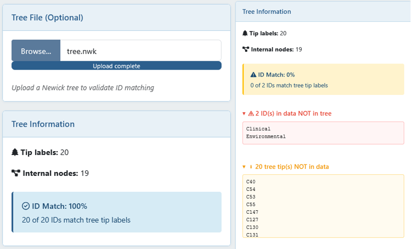
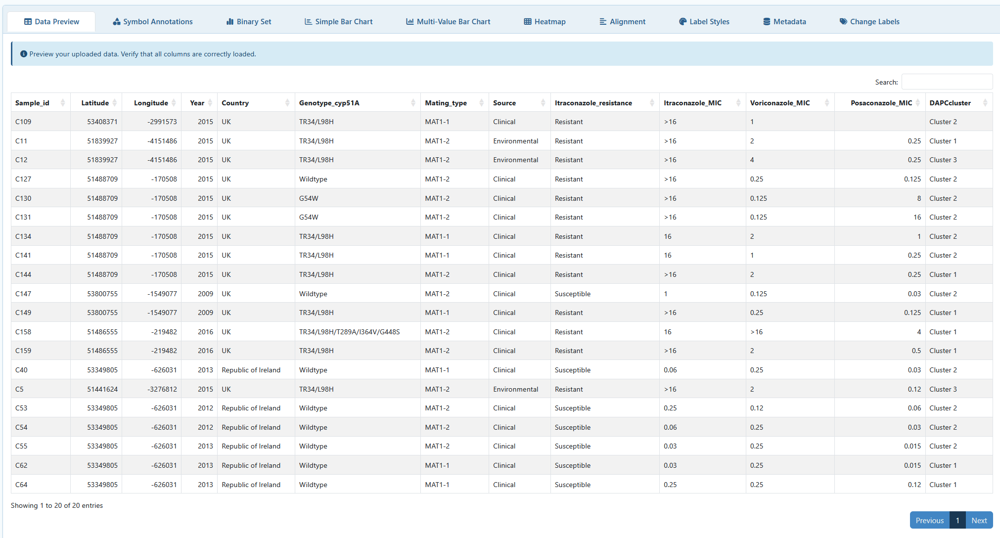
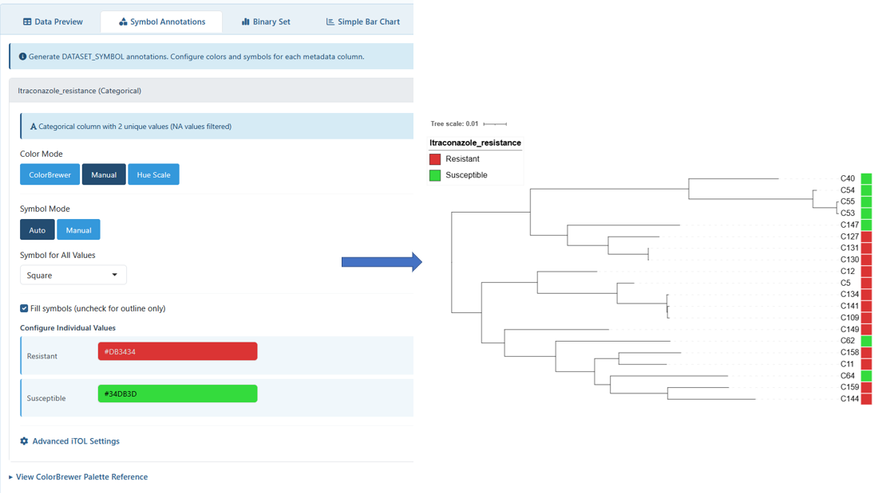
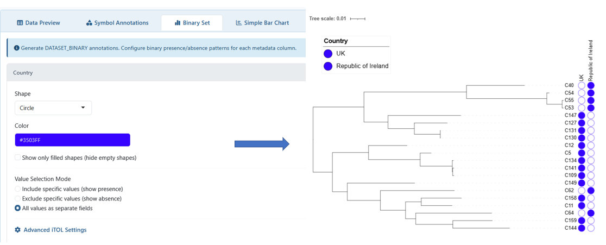
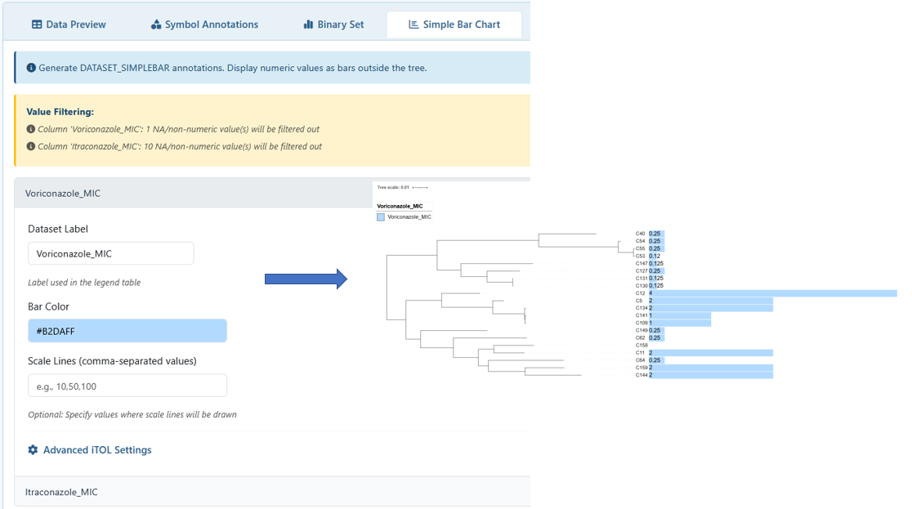
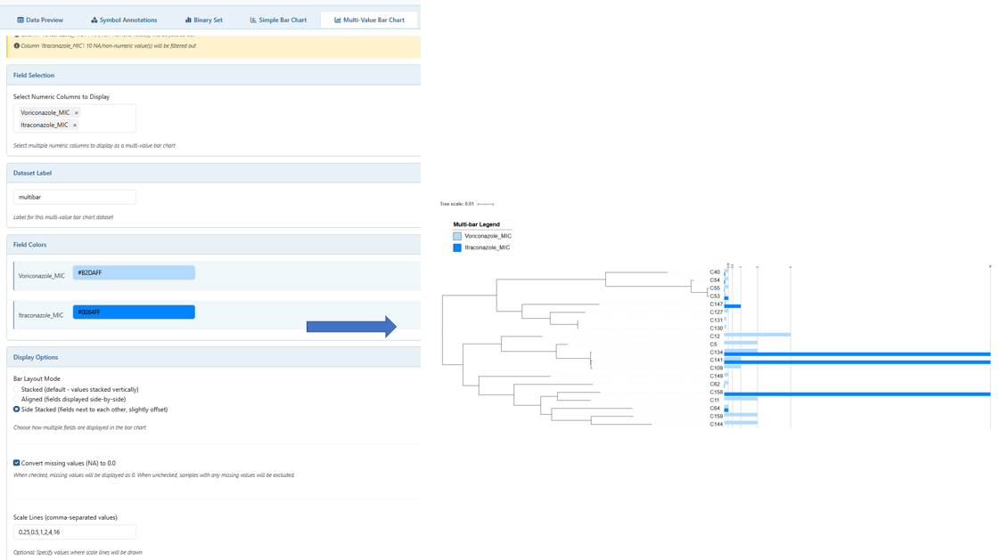
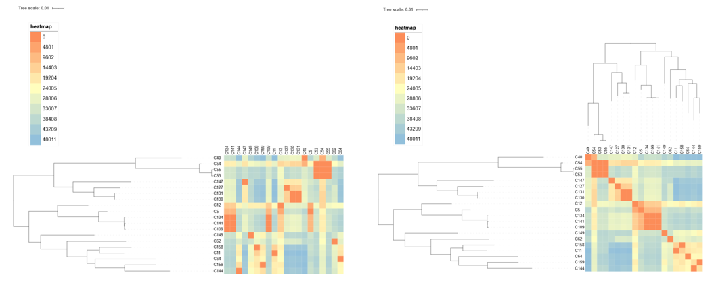
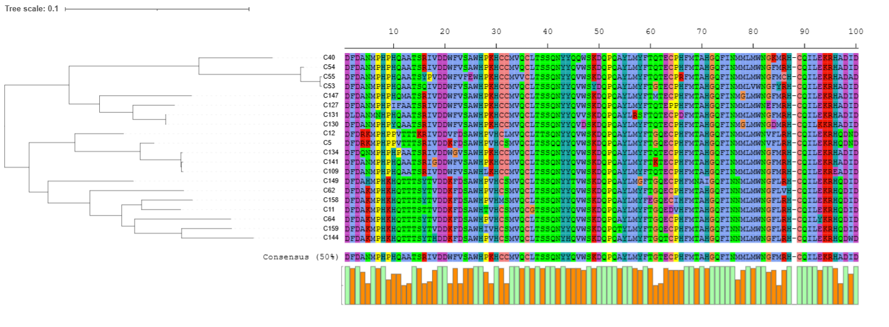
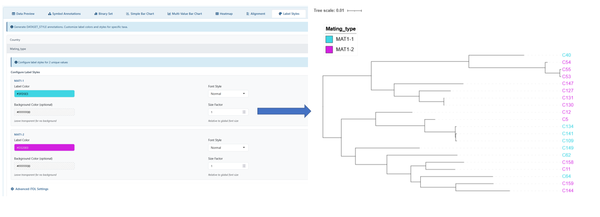
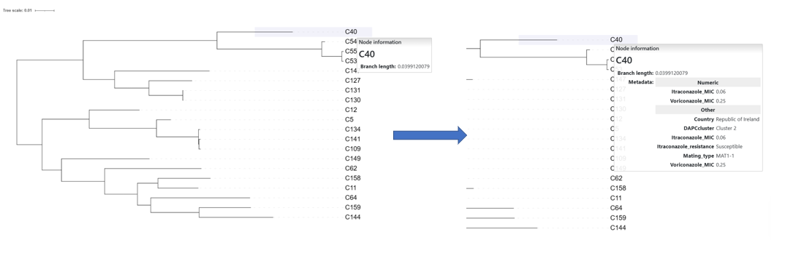

# iTOL Label Generator

A Shiny application for generating [iTOL](https://itol.embl.de/) (Interactive Tree of Life) annotation files from tabular metadata, enabling rapid visualization of phylogenetic data.

# Installation
Clone the repository and go to it:

```bash
git clone https://github.com/ManuelLeeuwerik/iTOL_Label_Generator.git

cd iTOL_Label_Generator/
```

Create [**conda**](https://docs.conda.io/projects/conda/en/stable/user-guide/install/index.html) environment and activate it:

```bash
conda env create -f rshiny.yaml
conda activate rshiny
```
Run the App:

```bash
Rscript run_app.R
```

## Example Data

An example dataset is provided in the `example_data/` folder. You can use this dataset to quickly test the application without preparing your own data.

- `tree.nwk` – phylogenetic tree
- `metadata.csv / .tsv / .xlsx` – tabular metadata
- `heatmap_data.tsv` - demo heatmap data
- `protein_alignment.fasta` - demo protein alignment sequence
- `DNA_alignment.fasta` - demo DNA alignment sequence

This dataset is a subset from a published open-access study and has been used for demonstration purposes.

> Rhodes, J., Abdolrasouli, A., Dunne, K. et al. Population genomics confirms acquisition of drug-resistant Aspergillus fumigatus infection by humans from the environment. Nat Microbiol 7, 663–674 (2022). https://doi.org/10.1038/s41564-022-01091-2


# Usage Workflow
## 1. Upload Data
Click `Browse` to upload a file:
- TSV (tab-separated values)
- CSV (comma-separated values)
- XLSX (Excel file)
  - If the file has multiple sheets, a dialog will appear to select which sheet to import

  
*Figure 1: File upload interface with Excel sheet selection dialog*

## 2. Configure Columns
- **ID Column:** Select the column that contains unique identifiers matching your phylogenetic tree tip labels
- **Columns to Visualize:** Choose one or more metadata columns to generate annotations from
- **Dataset Label:** Enter a descriptive name for your annotation set (used in filenames and iTOL legends)

  
*Figure 2: Column selection for ID and metadata fields*

- **Validate Tree Matching (optional):** To ensure your annotations will work correctly in iTOL, you can upload your phylogenetic tree file (.nwk, .newick, .tree, .tre) in the sidebar. The app will:
  - Display the number of tip labels and internal nodes in your tree
  - Compare your selected ID column against the tree tip labels
  - Show match percentage and identify mismatches:
    - IDs in data NOT in tree: Values that won't appear in your iTOL visualization
    - Tree tips NOT in data: Tree labels that won't receive annotations

  
*Figure 3: Tree validation showing correct match (left) vs (right)*

## 3. Generate Annotations
Navigate through tabs to create different annotation types:

### `Data Preview`
- Verify uploaded data structure before generating annotations

  
*Figure 4: Uploaded metadata preview table*

### `Symbol Annotations`
- Display categorical or numeric data as colored symbols next to tree tips
- **Color Options**:
  - ColorBrewer palettes: Choose from sequential (numeric data) or qualitative (categorical data) color schemes
  - Manual colors: Select custom colors for each unique value
  - Hue Scale: Automatically generate colors using a hue-based palette
- **Symbol Options**:
  - Auto mode: Apply the same symbol shape to all values
  - Manual mode: Assign different shapes (square, circle, star, triangle, checkmark) to each value
- Fill Options: Toggle between filled symbols or outline-only shapes
- View ColorBrewer palette reference within the tab for guidance

  
*Figure 5: Symbol configuration with manual colors (left) and iTOL output (right)*

### `Binary Set`
- Show presence/absence patterns for categorical data
- Configure symbol shape, color, and fill behavior
- **Value Selection Modes**:
  - Include specific values: Show presence only for selected values
  - Exclude specific values: Show presence for all except selected values
- All values as separate fields: Create individual binary fields for each unique value
- Ideal for displaying trait presence, gene presence/absence, or classification membership

  
*Figure 6: Binary set configuration (left) and iTOL output (right)*

### `Simple Bar Chart`
- Display single numeric values as horizontal bars outside the tree
- Customize bar color, scale lines, and value labels
- **Value Label Options**:
  - Choose label position (outside, left, center, right)
  - Enable automatic label color contrast or set manual colors
- Useful for showing single measurements like genome size, abundance, or scores

  
*Figure 7: Simple bar configuration (left) and iTOL output (right)*

### `Multi-Value Bar Chart`
- Display multiple numeric columns simultaneously
- **Display Modes**:
  - Stacked bars: Values stacked on top of each other
  - Aligned bars: Values displayed side-by-side for direct comparison
  - Side stacked: Hybrid approach with fields next to each other
- Configure individual colors for each field

  
*Figure 8: Multi-value bar configuration with side stacked layout (left) and iTOL output (right)*

### `Heatmap`
- Visualize multiple numeric columns as a color-coded heatmap
- Best is to upload a heatmap table formatted as `example/data/heatmap_data.tsv`
- **Color Options**:
  - ColorBrewer palettes: Choose from sequential or diverging color schemes
  - Manual colors: Define 2-color (min/max) or 3-color (min/mid/max) gradients
  - Reverse palette: Flip the color scale direction
- **Display Settings**:
  - Cell width: Adjust the size of individual heatmap cells
  - Border styling: Optional borders around cells with customizable width and color
  - Label customization: Control label size, rotation, and positioning
  - Missing values (NA) are displayed with a customizable color (default: white) and marked as "X"
  - Automatically creates a legend showing the color scale
- **Tree Integration (optional)**:
  - When a phylogenetic tree is uploaded, enable "Add FIELD_TREE" to display a tree structure above the heatmap
  - Fields will be ordered according to the tree topology

  
*Figure 9: Heatmap without tree uploaded (left) and with tree uploaded (right)*

### `Sequence Alignment`
- Display protein or DNA sequence alignments alongside your phylogenetic tree
- **Configuration**:
  - Upload a FASTA format alignment file (.fasta, .fa, .fna, .faa)
  - Select alignment type: Protein (amino acids) or DNA
  - Specify position range to display (start/end residue numbers, max 4000 residues)
- **Color Schemes**:
  - Choose from multiple coloring schemes based on amino acid properties:
    - Clustal: Standard Clustal coloring by amino acid properties
    - Zappo: Physico-chemical properties
    - Taylor: Residue type classification
    - Hydrophobicity, Helix/Strand/Turn propensity, Buried index
  - Or display without coloring
- **Highlighting Options**:
  - Consensus highlighting: Highlight positions matching the consensus sequence
  - Reference highlighting: Highlight differences from specified reference sequences
  - Mark reference sequences with customizable colored boxes
- **Display Features**:
  - Optional consensus sequence display below alignment (with adjustable threshold)
  - Conservation graph showing position-by-position conservation percentages
  - Inverse gap coloring to emphasize gaps
  - Adjustable font size and margin settings
- Sequence IDs in the FASTA file must match your tree tip labels

  
*Figure 10: Protein sequence alignment in iTOL*

### `Label Styles`
- Customize the appearance of tree tip labels based on metadata values
- **Configuration Options**:
  - Label Color: Set custom colors for labels
  - Font Style: Choose between normal, bold, italic, or bold-italic
  - Background Color: Optional colored background behind labels
  - Size Factor: Adjust label size relative to the global font size (0.1-5.0)
- Each unique value in a selected column can have its own style configuration
- Note: Only affects label styling; does not modify branch or node properties

  
*Figure 11: Label style settings (left) and iTOL output (right)*

### `Metadata`
- Export all selected columns in iTOL metadata format
- Generates a comprehensive metadata file that can be used for tree annotation and data exploration in iTOL
- All selected columns are included as-is without filtering

  
*Figure 12: Node hover without metadata (left) and with metadata (right)*

### `Change Labels`
- Replace tree tip labels with alternative values from your data
- Configuration:
  - ID Column: Select the column containing current/original tree labels
  - New Tip Label Column: Select the column with replacement labels
- Useful for switching between different identifier systems (e.g., accession numbers to species names)

## 4. Download
- Single files: Download individual annotation files for each column
- ZIP archives: Download all annotations of the same type at once
- Files are ready to upload directly to iTOL by dragging and dropping onto your tree

## Notes
- **Symbol sizes:** May appear different between circular and rectangular tree layouts in iTOL. The app is optimized for rectangular layouts, this can be changed in iTOL as well
- **Color palettes:** Sequential palettes (Blues, Greens, etc.) work best for numeric data; qualitative palettes (Set1, Paired, etc.) work best for categorical data
- **Bar scaling:** Scale lines help provide reference points for numeric values; specify them as comma-separated values (e.g., "10,50,100")
- **NA values:** Automatically filtered from visualizations. If you need to represent unknown data, use explicit text like "Unknown" instead
- **Matching labels:** The ID column must exactly match tree tip labels (case-sensitive, whitespace-sensitive)
- **Numeric detection:** Columns are automatically detected as numeric if they contain values convertible to numbers

## Troubleshooting
| Issue | Solution | 
| ----- | --------- |
| "No numeric columns selected" | Ensure selected columns contain numeric or numeric-convertible values. Check for non-numeric characters or inconsistent formatting |
| "Annotations don't appear in iTOL" | Verify the ID column exactly matches tree tip labels. iTOL will give the error: "Couldn't find ID.. in the tree" |
| "Download button not appearing" | Ensure valid columns are selected and all required settings are configured. Check for error messages in the UI |
| "Excel sheet selection doesn't appear" | The file contains only one sheet and will be loaded automatically. No selection needed |
| "More values in the iTOL legend than visible on the tree" | The input table contains samples that are not present in the tree. Their values are included in the dataset, resulting in legend entries for categories that don't appear on the tree. Remove samples not present in the tree from your input table to resolve this |

> Compatible with: iTOL v7.51 (other versions not tested). This is an unofficial tool for generating annotation files compatible with iTOL and is not affiliated with or endorsed by iTOL.